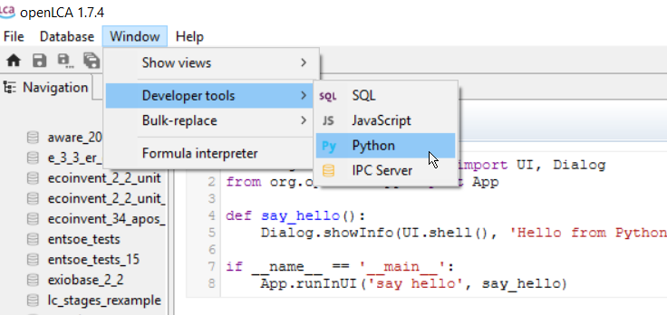

# openLCA Python Tutorial
[openLCA](https://github.com/GreenDelta/olca-app) is a Java application
and, thus, runs on the Java Virtual Machine (JVM). [Jython](http://www.jython.org/)
is a Python 2.7 implementation that runs on the JVM. It compiles Python code to
Java bytecode which is then executed on the JVM. The final release of Jython 2.7
is bundled with openLCA. Under `Window > Developer tools > Python` you can
find a small Python editor where you can write and execute Python scripts:



In order to execute a script, you click on the `Run` button in the toolbar of
the Python editor:


The script is executed in the same Java process as openLCA. Thus, you have
access to all the things that you can do with openLCA via this scripting API
(and also to everything that you can do with the Java and Jython runtime). Here
is a small example script that will show the information dialog below when you
execute it in openLCA:

```python
from org.openlca.app.util import UI, Dialog
from org.openlca.app import App

def say_hello():
    Dialog.showInfo(UI.shell(), 'Hello from Python (Jython)!')

if __name__ == '__main__':
    App.runInUI('say hello', say_hello)
```


## Relation to standard Python
As said above, Jython runs on the JVM. It implements a great part of the
[Python 2.7 standard library for the JVM](http://www.jython.org/docs/library/indexprogress.html).
For example the following script will work when you set the file
path to a valid path on your system:

```python
import csv

with open('path/to/file.csv', 'w') as stream:
    writer = csv.writer(stream)
    writer.writerow(["data you", "may want", "to export",])
```

The Jython standard library is extracted to the `python` folder of the openLCA
workspace which is by default located in your user directory
`~/openLCA-data-1.4/python`. This is also the location in which you can put your
own Jython 2.7 compatible modules. For example, when you create a file
`tutorial.py` with the following function in this folder:

```python
# ~/openLCA-data-1.4/python/tutorial.py
def the_answer():
  f = lambda s, x: s + x if x % 2 == 0 else s
  return reduce(f, range(0, 14))
```

You can then load it in the openLCA script editor:

```python
import tutorial
import org.openlca.app.util.Info as Info

Info.showBox('The answer is %s!' % tutorial.the_answer())
```

An **important thing** to note is that Python modules that use C-extensions
(like NumPy and friends) or parts of the standard library that are not
implemented in Jython are **not** compatible **with Jython**. If you want to
interact from  standard CPython with openLCA (using Pandas, NumPy, etc.)
**you can use** the [openLCA-IPC Python API](https://github.com/GreenDelta/olca-ipc.py).


## The openLCA API
As said above, with Jython you directly access the openLCA Java API. In Jython,
you interact with a Java class in the same way as with a Python class. The
openLCA API starts with a set of classes that describe the basic data model,
like `Flow`, `Process`, `ProductSystem`. You can find these classes in the
[olca-module repository](https://github.com/GreenDelta/olca-modules/tree/master/olca-core/src/main/java/org/openlca/core/model).

```
...
```

## Content
* ...
* [Using visualization APIs](./data_viz.md)
* [The basic data model](./data_model.md)
* [Setting up a development environment](./ide_setup.md)
* [Examples](./examples.md)


## License
This project is in the worldwide public domain, released under the
[CC0 1.0 Universal Public Domain Dedication](https://creativecommons.org/publicdomain/zero/1.0/).


