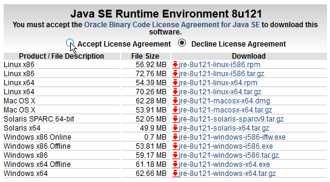
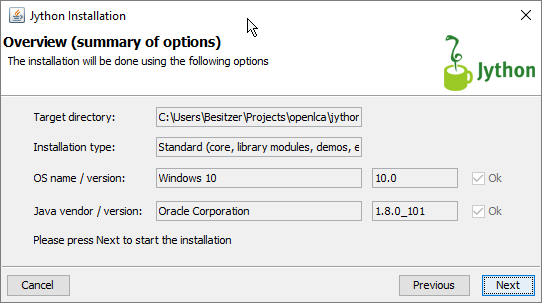
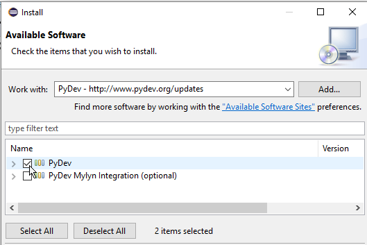
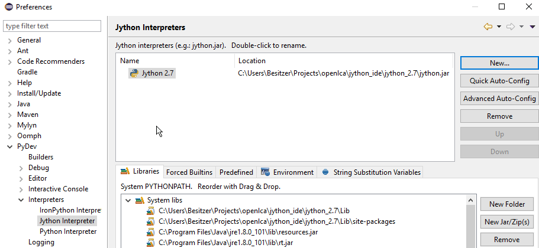
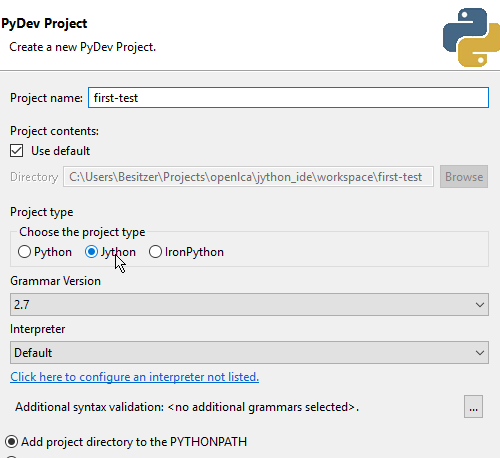
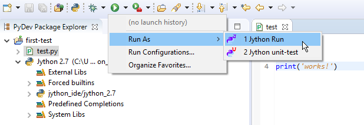
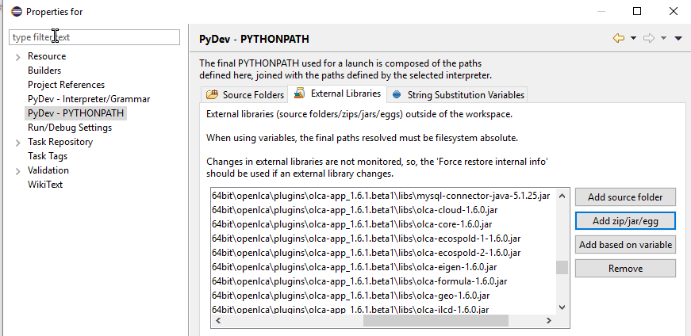
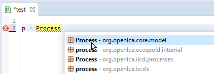

## Setting up an Integrated Development Environment
The integrated Python editor in openLCA is nice if you want to quickly write
and execute small scripts directly in openLCA. However, if you want to do
something more complicated it is better to use an editor with advanced
features like code formatting, auto-completion, etc. This chapter explains how 
you can setup the integrated development environment (IDE) 
[PyDev](http://www.pydev.org/) to use it with the openLCA API.


### Installing Java and Jython
As described in the previous chapters, openLCA is a standard Java desktop
application. To access the openLCA API we use [Jython](http://www.jython.org/)
which is a Python implementation that runs on the Java Virtual Machine (JVM) and
is directly integrated in openLCA. Thus, if we want to access the openLCA API
outside of openLCA we need to first install a Java Runtime Environment (JRE) >= 8
and Jython.

To install the JRE, just go to the [Oracle download site](http://www.oracle.com/technetwork/java/javase/downloads/jre8-downloads-2133155.html),
accept the license, and download the respective installation package for your
platform:



To test if Java is correctly installed, just open a command line and execute
the following command:

```bash
java -version
```

This should return something like this:

```
java version "1.8.0_101"
Java(TM) SE Runtime Environment ...
```

After this, we can download and run the [Jython installer](http://www.jython.org/downloads.html)
which is also a Java application. In the installation wizard, we select
the standard installation type and an arbitrary folder, e.g.
`~/openlca/jython_ide/jython_2.7`:



To test the installation, you can run the `jython` executable in the 
`jython_2.7/bin` folder which will open a standard 
[Python REPL](https://docs.python.org/2/tutorial/interpreter.html).


### Installing PyDev
PyDev is a Python IDE for [Eclipse](http://www.eclipse.org/) with Jython support.
To use it with Jython, we need Eclipse with Java development tools and the 
easiest way to get this is to start with an Eclipse installation. Thus, download
the [Eclipse IDE for Java Developers](http://www.eclipse.org/downloads/eclipse-packages/)
and extract it to a folder (e.g. `~/openlca/jython_ide/eclipse`):


Start the Eclipse executable and create a workspace, e.g. under 
`~/openlca/jython_ide/workspace` (this is just a folder where your projects are
stored). Now we can install PyDev via the menu `Help > Install New Software...`. 
In the installation dialog click on `Add...` to register the PyDev update site
http://www.pydev.org/updates:


Then select the PyDev package, accept the license, install it, and restart
Eclipse:



After the restart, you can configure the Jython interpreter under 
`Window > Preferences` and select the `jython.jar` from your Jython installation
(e.g. `~/openlca/jython_ide/jython_2.7/jython.jar`):




### Using the openLCA API
Now you can create a new PyDev project under `File > New > Project... > PyDev Project`.
You just need to give it a name and select Jython as interpreter:



When you now create a script, you should be able to run it directly with the
Jython interpreter:



To use the openLCA API in the project, right click on the project and open
the project `Properties`. Click on the `PyDev PYTHONPATH` and in the
`External Libraries` tab on the button `Add zip/jar/egg` button. Then select
all `jar` files in the `openlca/plugins/olca-app_<version>/libs` folder of
an openLCA installation you want to use:



Now you should be able to use all the IDE features of PyDev like auto-completion
etc.: 


